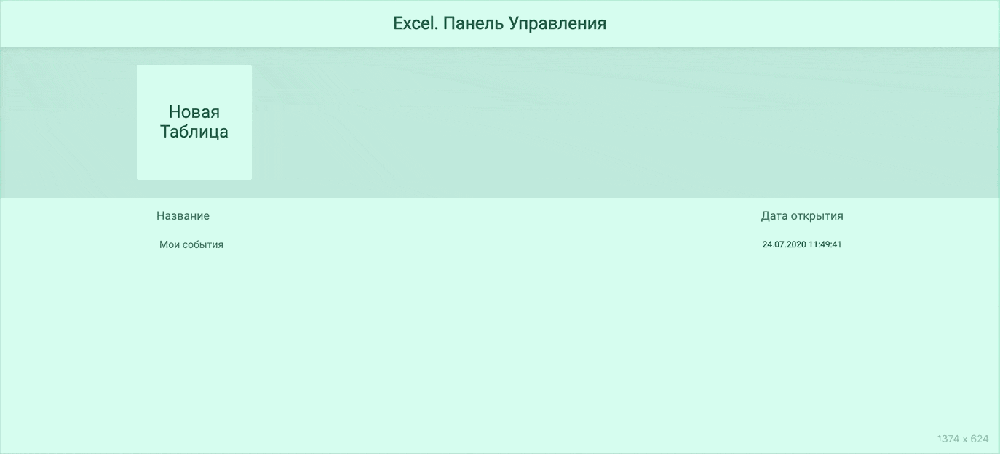

# Excel
*Excel* - Приложение, работающее по принципу Google таблиц Excel.

## Getting Started
```
$ npm install  
$ npm start
```

### MVP пользователя
- Создание, сохарнение и удаление таблиц
- Изменение размеров колонок и строк
- Изменение стилей ячеек
- Выполнение простейших функций Excel
- Выделение множества ячеек путем нажатия клавиши shift

### Используемые технологии
Данное приложение написано без использования сторонних фреймворков
- HTML 5/ SCSS
- JavaScript
- webpack
- LocalStorage
- Использованы принципы SOLID и ООП

### Как это выглядит
